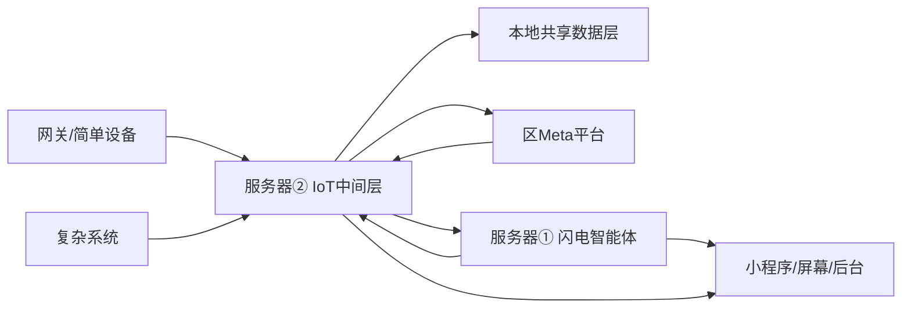

# 三棵松公园软件工程分工建议

版本：V0.1  
日期：2026-05-03  
用途：用于与 PM、分包方、平台团队沟通软件工程范围、责任边界和协作方式。

## 1. 编制依据

- `DS-20260503-003`：《20260421 最终智能化清单》，作为软件范围、设备范围和技术要求基准。
- `D-20260503-006`：深开鸿不参与三棵松项目实施；区 Meta 平台团队提供对接文档和技术支持，我方或服务器②分包方负责实现对接、联调和验收。
- `C-20260503-001`：所有输出必须符合最终智能化清单。
- `C-20260503-002`：涉及项目资料变更前，必须先确认思路、范围、依据、影响和风险。

当前 `SYNC/project_data.json` 尚未同步在线工作清单任务项，因此本文不判断具体进度、负责人或 blocker，仅作为软件工程分包和沟通框架。

## 2. 总体分工原则

整体软件工程不建议由单一软件公司笼统全包，应按系统层级和责任边界拆分。

核心原则：

> 网关负责现场简单设备和本地闭环；服务器②负责 IoT 中间层、数据库、统一物模型和区 Meta 对接；服务器①负责“闪电”智能体和 AI 业务；前端团队负责游客端、屏幕端和管理端；总集成方负责接口、数据、联调和验收闭环。

设备接入原则：

> 简单设备上网关，复杂系统上服务器②。

- 简单设备：灯控、星闪、NFC、光感、水位、土壤、音响、屏幕、拾音器、简单 RS485/Modbus 感知器。
- 复杂系统：停车场、门禁、闸机、充电桩、视频平台、水电表集中系统、光伏储能、水肥一体机、水库既有系统。

## 3. 推荐软件分包结构

| 序号 | 软件包 | 主责方类型 | 核心职责 | 主要配合方 |
| --- | --- | --- | --- | --- |
| 1 | 总集成与软件架构包 | 我方技术 PM / 软件架构师 | 总架构、接口规范、数据规范、联调验收 | 全部分包 |
| 2 | 网关端侧软件包 | 润和 / 诚迈 / 鸿蒙网关团队 | 灯杆侧设备接入、本地闭环、网关 MQTT | 服务器②、设备厂家 |
| 3 | 服务器② IoT 中间层包 | IoT 平台集成后端团队 | 复杂系统接入、物模型、Meta 同步、本地数据入口 | 区 Meta 平台团队、设备厂家 |
| 4 | 数据库与数据平台包 | 服务器②团队或数据库工程师 | 业务库、时序库、缓存、向量库、数据字典 | 服务器①、服务器②、前端 |
| 5 | 服务器①“闪电”智能体包 | AI 应用团队 | 大模型、RAG、ASR/TTS、数字人、AI 业务服务 | 服务器②、前端、网关 |
| 6 | 前端应用包 | 小程序 / H5 / 大屏团队 | 小程序、鸿蒙元服务、灯杆屏、瀑布屏、后台 Web | 服务器①、服务器② |
| 7 | 视频与流媒体包 | 视频平台集成团队 | 摄像机、NVR、GB/T28181、直播、转码 | 服务器②、前端 |
| 8 | 运维部署与安全包 | DevOps / 安全工程师 | 部署、监控、日志、备份、证书、权限 | 全部分包 |

## 4. 各软件包详细职责

### 4.1 总集成与软件架构包

定位：整个软件工程的责任边界控制者和接口协调者。

主要职责：

- 建立总体软件架构图。
- 明确设备接入归属：网关接入、服务器②接入、外部平台接入。
- 制定统一设备编码、点位编码、用户编码、事件编码规则。
- 制定 MQTT Topic、HTTP API、WebSocket、文件接口等总规范。
- 制定数据库总模型和数据字典。
- 制定分包交付物清单和验收标准。
- 组织联调计划、问题闭环、版本发布和变更控制。

输出成果：

- 软件总体架构图。
- 设备接入归属表。
- 分包责任矩阵。
- 接口总规范。
- 数据字典与编码规则。
- 联调计划与验收清单。

适合人员：

- 软件架构师。
- 技术 PM。
- 接口经理。

### 4.2 网关端侧软件包

定位：负责灯杆侧设备、简单感知器和本地实时闭环。

主要职责：

- 星闪 Mesh 管理。
- NFC 打卡事件接收。
- 灯控、音响、屏幕、拾音器接入。
- 简单 RS485 / Modbus 感知器接入，包括光感、水位、土壤等。
- 本地 AI 事件识别结果上报。
- 本地照明、广播、应急联动策略执行。
- 断网情况下按本地缓存策略运行。
- 通过 MQTT/HTTP 向服务器②上传状态、事件、告警和遥测数据。

不建议纳入网关端侧包的内容：

- 停车场系统适配。
- 门禁/闸机系统适配。
- 充电桩平台适配。
- 区 Meta 平台全量对接。
- 全园数据库主架构。
- 视频平台/NVR/GB28181 中心化接入。

输出成果：

- 网关端侧软件。
- 网关 MQTT Topic 清单。
- 网关本地策略说明。
- 网关接入设备清单。
- 网关与服务器②联调报告。

适合分包：

- 润和。
- 诚迈。
- 具备 OpenHarmony/RK3568/RK3588/星闪网关开发经验的团队。

### 4.3 服务器② IoT 中间层包

定位：园区级 IoT 中间层、复杂系统接入中心、Meta 接入代理、本地共享数据入口。

主要职责：

- 部署和配置 EMQX / MQTT Broker。
- 部署和配置 ThingsBoard 或等效 IoT 设备管理底座。
- 接收网关上传的设备状态、事件、告警和遥测数据。
- 对接复杂业务系统：
  - 海康停车场。
  - 海康门禁/闸机。
  - 充电桩。
  - 光伏逆变器与储能 BMS。
  - 水肥一体机和喷灌系统。
  - 水电表。
  - 水库既有设备。
  - SOS 求助系统。
- 建立园区统一设备物模型。
- 将内部物模型转换为区 Meta 平台要求的数据格式。
- 按区 Meta 平台团队提供的文档完成接入、联调和验收。
- 建立策略缓存层，将 Meta、管理后台或 AI 业务策略下发到网关和设备系统。
- 建立 OTA 中转服务。
- 建立统一设备控制 REST API，供服务器①“闪电”智能体和管理后台调用。

输出成果：

- 服务器②后端服务。
- 设备物模型文档。
- Meta 对接接口文档。
- 复杂系统适配服务。
- 策略缓存与 OTA 服务。
- 设备控制 API 文档。
- 服务器②与网关、Meta、服务器①联调报告。

适合分包：

- IoT 平台集成后端团队。
- 熟悉 EMQX、ThingsBoard、MQTT、HTTP API、设备物模型的团队。
- 有海康 ISAPI/SDK、Modbus、OCPP、DL/T645、M-Bus、GB/T28181 集成经验的团队。

关键依赖：

- 区 Meta 平台接入文档。
- 区 Meta 平台测试环境、账号、证书、鉴权方式。
- 各设备厂家接口文档和联调支持。

### 4.4 数据库与数据平台包

定位：整个项目的数据底座，支撑服务器②、服务器①、前端应用、管理后台和后续运维。

建议数据组件：

- PostgreSQL：业务主库。
- TimescaleDB 或 InfluxDB：时序数据。
- Redis：缓存、策略、会话、命令状态。
- ChromaDB：智能体知识库向量库。
- 文件/对象存储：图片、视频、音频、OTA 包、模型文件。
- 日志存储：操作日志、设备日志、接口日志、告警日志。

主要职责：

- 设计设备台账表、点位表、用户表、活动表、打卡表、积分表、告警表、工单表、内容表。
- 设计时序数据结构，用于水位、环境、能耗、设备状态等数据。
- 设计知识库结构和向量库更新机制。
- 设计数据备份、恢复、归档、权限和脱敏方案。
- 建立统一数据字典和字段命名规范。

输出成果：

- 数据库 ER 图。
- 数据字典。
- 初始化脚本。
- 备份恢复方案。
- 数据权限与脱敏规则。
- 数据接口字段表。

建议主责：

- 可由服务器②团队主责，但必须单列工作量和验收物。
- 如服务器②团队数据库能力不足，应单独配置数据库工程师。

### 4.5 服务器①“闪电”智能体包

定位：AI 服务核心和游客互动业务核心。

主要职责：

- 大模型推理服务。
- RAG 知识库。
- ASR 语音识别。
- TTS 语音合成。
- 数字人驱动。
- 导览问答。
- 生态主播。
- 运动伙伴。
- 汽车主题打卡游戏逻辑。
- 积分规则。
- 向小程序、灯杆屏、瀑布屏提供 AI 服务接口。
- 调用服务器②统一设备控制 API，触发灯光、广播、导航、告警联动。

输出成果：

- AI 服务接口。
- 知识库管理接口。
- 语音服务接口。
- 数字人驱动接口。
- 业务服务接口。
- 与服务器②、前端、网关联调报告。

适合分包：

- AI 应用团队。
- 熟悉大模型部署、RAG、ASR/TTS、FastAPI、vLLM、向量数据库的团队。

关键边界：

- 服务器①不直接接复杂设备。
- 设备状态和控制能力应通过服务器②统一 API 获取和调用。

### 4.6 前端应用包

定位：游客端、运营端、屏幕端的统一交互体验。

主要范围：

- 三棵松公园小程序。
- 鸿蒙元服务。
- 灯杆导览屏。
- 入口瀑布屏三块。
- 鸿蒙小站屏。
- 小程序后台/管理端。
- 地图导览、打卡游线、图鉴、积分、生态直播、闪电问答、个人中心。

主要职责：

- UI/UX 设计。
- 小程序前端开发。
- 大屏 H5/屏幕端开发。
- 后台 Web 开发。
- 与服务器①对接 AI 问答、数字人、语音、导览。
- 与服务器②对接设备状态、停车、告警、直播、积分数据。

输出成果：

- UI 设计稿。
- 小程序。
- 鸿蒙元服务。
- 屏幕端 H5。
- 管理后台 Web。
- 前端接口联调报告。

适合分包：

- 小程序团队。
- Vue/React/H5 大屏团队。
- 有地图、打卡、积分、直播前端经验的团队。

关键边界：

- 前端不直接连接设备。
- 前端不直接连接 Meta。
- 所有设备状态、控制、AI、直播数据应通过服务器①/服务器②接口获取。

### 4.7 视频与流媒体包

定位：摄像机接入、视频流管理、直播和大屏视频能力。

主要职责：

- 摄像机接入。
- NVR/视频平台对接。
- GB/T28181、ONVIF、RTSP 接入。
- 视频转码和分发。
- 生态直播。
- 安保直播。
- AI 事件快照和视频片段管理。
- 大屏、前端、小程序的视频播放接口。

输出成果：

- 视频接入方案。
- 视频流地址规范。
- 视频平台部署服务。
- 直播接口。
- 视频联调报告。

适合分包：

- 熟悉 ZLMediaKit、EasyDarwin、GB/T28181、海康/大华平台的视频集成团队。

关键边界：

- 视频流不建议全部经网关转发。
- 网关可处理本地 AI 事件和快照，中心化视频流由视频平台或服务器②协调。

### 4.8 运维部署与安全包

定位：保障软件系统可部署、可监控、可恢复、可审计。

主要职责：

- 服务器部署。
- Docker/容器化。
- 服务监控。
- 日志采集。
- 数据备份。
- SSL/证书。
- 防火墙和专网配置。
- 用户权限。
- 数据脱敏。
- 远程升级。
- 故障告警。

输出成果：

- 部署手册。
- 运维手册。
- 备份恢复方案。
- 安全配置说明。
- 监控告警配置。
- 账号权限清单。

适合分包：

- DevOps 工程师。
- 网络安全工程师。
- 可由服务器②团队承担，但必须单列工作量。

## 5. 总体数据关系

推荐数据流：

核心含义：

- 网关负责现场实时接入和本地闭环。
- 服务器②负责设备统一接入、物模型、数据库和 Meta 同步。
- 服务器①负责 AI 和业务智能。
- 前端只通过服务器①/服务器②接口取数和交互。
- 区 Meta 平台作为上层平台接入和监管入口，不作为本地实时闭环唯一依赖。

## 6. PM 沟通重点

与 PM 沟通时建议重点确认以下事项：

1. 是否认可“简单设备上网关，复杂系统上服务器②”的接入原则。
2. 是否单独设置“总集成与软件架构”角色。
3. 服务器②是否单独招 IoT 平台集成后端团队。
4. 数据库是否单独列验收物，而不是隐藏在各分包内部。
5. 区 Meta 平台接入文档由谁获取，何时获取。
6. 海康、充电桩、水电表、水肥等设备厂家接口文档由谁负责收集。
7. 前端、小程序、屏幕、后台是否由一个团队统一体验。
8. 视频流媒体是否单独分包。
9. 运维部署、安全、备份、监控是否单独报价。

## 7. 当前主要风险

| 风险 | 影响 | 建议 |
| --- | --- | --- |
| 微信在线工作清单当前无法直接读取 | 最新任务状态无法由 AI 自动确认 | 需导出或同步到 `SYNC/project_data.json` |
| 区 Meta 平台文档未到位 | 服务器② Meta 同步无法锁定字段和验收 | 尽快获取接入文档、测试环境、账号和证书 |
| 设备厂家接口文档未到位 | 停车、门禁、充电桩等适配工作量无法准确报价 | 建立设备接口资料收集表 |
| 数据库缺少总设计 | 各分包各自建表，后期联调困难 | 先做数据字典和 ER 图 |
| 分包边界不清 | 容易出现互相甩锅 | 用责任矩阵锁定主责方、配合方和验收物 |
| 视频系统被并入普通前端或网关 | 性能和联调风险高 | 单独设置视频与流媒体包 |
| 运维安全被忽略 | 上线后不可维护、不可追溯 | 单列部署、监控、日志、备份和权限工作 |

## 8. 建议下一步

1. 先由 PM 确认本文的软件包划分。
2. 建立《软件分包责任矩阵》。
3. 建立《设备接入归属表》。
4. 向区 Meta 平台团队索取接入文档和测试环境。
5. 向设备厂家索取接口文档。
6. 基于确认后的边界，分别编制：
   - 服务器②需求文档。
   - 数据库建设说明。
   - 服务器①“闪电”智能体需求文档。
   - 前端应用需求文档。
   - 视频与流媒体需求文档。
   - 联调计划。

